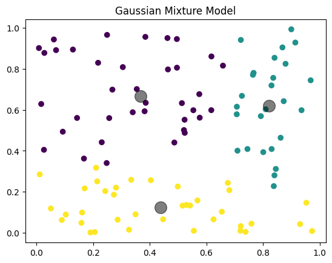

# GEOL0069_Week4

<!-- GETTING STARTED -->
## Getting Started

The task for the week 4 assignment in GEOL0069 Artificial Intelligence for Earth Observation is to use unsupervised learning methods for altimetry classification and in particular, distinguishing between sea ice and leads in Sentinel-3 altimetry datasets. This builds on the notebook called Chapter1_Unsupervised_Learning_Methods_Michel.ipynb

### Prerequisites

The following software needs to be installed to run the code.
* Using pip install:
  ```sh
  !pip install netCDF4
  ```
  ```sh
  !pip install basemap
  ```
  ```sh
  !pip install cartopy
  ```
* Mounting Google Drive on Google Colab
  ```sh
  from google.colab import drive
  drive.mount('/content/drive')
  ```

  <!-- CONTEXT -->
## Context

One of the main aims of the Sentinel-3 mission is to measure sea surface topography, with applications to the study of sea level, sea-ice and wind speed over the ocean surface, as well as ocean currents, waves, eddies and tides.

_For more information on the Sentinel-3 mission, please visit the [Copernicus Sentinel Online Website](https://sentinels.copernicus.eu/web/sentinel/missions/sentinel-3)_
_or the [Sentinel-3 Altimetry User Guide](https://sentinel.esa.int/web/sentinel/user-guides/sentinel-3-altimetry)_

In order to get information about the surface, altimetry satellites send radar signals to the Earth which interact with the surface, and the part of the signal that is reflected back to the sensor is called an "echo". The time it takes for this signal to be reflected back is used to measure the elevation of features on the surface.

The difference in physical properties between different materials or substances alters the shape and strength of the echo that is received by the sensor, allowing us to use these echos as indicators of what is going on at the surface. For example, to distinguish between sea ice and leads which is the topic of this project. 

<p align="right">(<a href="#readme-top">back to top</a>)</p>

  <!-- MODELS -->
## Unsupervised Learning: Gaussian Mixture Models

The unsupervised learning method used in this project is Gaussian Mixture Models or GMMs. These are probabilistic models that are used to represent normally distributed subpopulations of an overall population (GEOL0069 – Week 4 Jupyter Book). They assume that the data used has been generated from a mixture of different Gaussian distribution that have their own means and variances (and therefore standard deviations). GMMs allow us to represent complex distributions through the combination of simpler distributions, making them useful for clustering and density estimations.

The key components of a GMM include the number of components or Gaussians, the expectation-maximization algorithm, which is an iterative process that calculates the probability that a certain data point belongs to a certain cluster and updates the parameters to maximize the likelihood of the data accordingly, and covariance type (GEOL0069 – Week 4 Jupyter Book).

Other unsupervised learning methods include K-means clustering or support vector machines.

Below is a basic code implementation for a Gaussian Mixture Model.

```sh
from sklearn.mixture import GaussianMixture
import matplotlib.pyplot as plt
import numpy as np

# Sample data
X = np.random.rand(100, 2)

# GMM model
gmm = GaussianMixture(n_components=3)
gmm.fit(X)
y_gmm = gmm.predict(X)

# Plotting
plt.scatter(X[:, 0], X[:, 1], c=y_gmm, cmap='viridis')
centers = gmm.means_
plt.scatter(centers[:, 0], centers[:, 1], c='black', s=200, alpha=0.5)
plt.title('Gaussian Mixture Model')
plt.show()
  ```



<p align="right">(<a href="#readme-top">back to top</a>)</p>

  <!-- FUNCTIONS -->

## Reading in the Necessary Functions & Running the GMM Model

In order to ensure that data is compatible with the chosen analytical model, the data needs to be preprocessed. This includes transforming raw data into variables such as peakiness and stack standard deviation, as well as removing NaN values (GEOL0069 – Week 4 Jupyter Book).

The Gaussian model can be initialised using GaussianMixture, imported from sklearn.mixture, and defining the number of components (or clusters) and the random state, which is a parameter that ensures the reproducibility of the results. The GMM model can then be fit (gmm.fit) to the data depending on how the data is cleaned and then the cluster labels are predicted (gmm.predict) for these data points.

_For more information on the parameter options for GaussianMixture, please refer to the [sklearn Guide](https://scikit-learn.org/stable/modules/generated/sklearn.mixture.GaussianMixture.html)_

The resulting clusters of functions can then be extracted and plotted using plt from matplotlib.pyplot. The functions in the sea ice cluster are been labelled '0' and the lead functions have been labelled '1' (i.e. waves_cleaned[clusters_gmm == 1] are lead functions).

The mean sea ice and lead functions are plotted using

```sh
plt.plot(np.mean(waves_cleaned[clusters_gmm==0],axis=0),label='sea ice')
plt.plot(np.mean(waves_cleaned[clusters_gmm==1],axis=0),label='lead')
plt.legend()
  ```


<p align="right">(<a href="#readme-top">back to top</a>)</p>
